# Quant Finance ML/DL Analytics — Project Wiki

## Project Overview

A personal quant finance analytics platform. The end goal is an automated pipeline that fetches financial data, transforms it into Parquet files, stores it in Cloudflare R2, serves it via a backend API, and displays it on a Vercel-hosted frontend.

---

## System Architecture


[View Mermaid source](diagrams/system/system.mmd)

The Backend API (Node + Fastify) and the R2 → API → Frontend data flow are now live for three funds (VOO, S&P 500, Nasdaq) — see [Sprint 2 Outcomes](sprint-2-backend-outcomes.md). Note this deviates from the originally planned FastAPI + DuckDB stack (see [§2.6 of Sprint 2](sprint-2-backend-outcomes.md#26-stack-change-fastapi-duckdb--node-fastify-hyparquet)).

---

## Infrastructure


[View Mermaid source](diagrams/infrastructure/infrastructure.mmd)

- **Compute:** GitHub Actions runner executes the Dagster job (`market_data_job`); DuckDB is used only as an in-run compute engine and does not persist across runs.
- **Storage:** Cloudflare R2 is the durable system of record — the pipeline writes Parquet there on every run.
- **Hosting:** Vercel hosts everything — the static Frontend **and** the Backend API, as Vercel Functions (`Frontend/api/*.js`) in the same `quant-fintech-frontend` project. Same origin, so no CORS is needed. (This superseded an earlier standalone `Backend/` Node+Fastify server — see [Sprint 2 addendum](sprint-2-backend-outcomes.md#addendum-migrated-to-vercel-functions-same-project-as-the-frontend).)
- **Local dev:** `.venv` + `dagster dev` for manual runs against the same DuckDB/dbt project.

---

## Database


[View Mermaid source](diagrams/database/database.mmd)

Two tables exist inside the DuckDB file used during a pipeline run:
- `yahoo_raw` — raw OHLCV bars landed by `raw_market_prices` (`date, ticker, open, high, low, close, adj_close, volume`).
- `stg_market_prices` — a dbt **view** (not a materialized table) over `yahoo_raw`, declared as a dbt source and selecting down to `date, ticker, close, volume`. This is what gets written to Parquet and pushed to R2.

---

## Class Architecture



[View Mermaid source](diagrams/classes/class-diagram.mmd)

Two parallel `Investment` hierarchies, one per language, kept intentionally similar in shape:
- **Frontend** (`Frontend/JS/Investment.js`): base `Investment` → `MarketFund` (fetches projections from `/api/investment/projection`) → `Voo` / `Sp500` / `Nasdaq`; and → `Super` / `SavingsAccount` (local synthetic math, unchanged). `CalculatorApp` only ever calls `projectSeries()` polymorphically.
- **Backend** (`Frontend/api/_lib/investment-calculations/`): base `Investment` → `MarketInvestment` (computes monthly returns from injected month-end closes) → `Voo` / `Sp500` / `Nasdaq`. `InvestmentController` only ever calls `project()` polymorphically via `funds.createFund()`.

Full detail: [Sprint 2 Outcomes](sprint-2-backend-outcomes.md#24-investment-class-hierarchy--mirrors-the-frontends-oop-style).

---

## API Architecture



[View Mermaid source](diagrams/api/api.mmd)

The first backend endpoints, served as **Vercel Functions** under `Frontend/api/` — same project and domain as the static site, so calls are same-origin and need no CORS (see the [stack-change note](sprint-2-backend-outcomes.md#26-stack-change-fastapi-duckdb--node-fastify-hyparquet) for why this isn't FastAPI/DuckDB as originally planned, and the [Sprint 2 addendum](sprint-2-backend-outcomes.md#addendum-migrated-to-vercel-functions-same-project-as-the-frontend) for why it isn't a standalone Node server either):

```
GET /api/health
GET /api/investment/projection?fund={voo|sp500|nasdaq}&liquidity={number}&years={1-40}
  -> { fund, ticker, liquidity, months, labels, balances, finalValue, gain, totalReturnPct }
```

Request path: Frontend `MarketFund.projectSeries()` → `fetch('/api/investment/projection?...')` → `InvestmentController` (validates input) → `MarketDataRepository` (cached `hyparquet` read of the R2 Parquet) + `funds.createFund()` (polymorphic `Investment.project()`) → JSON response. Full detail: [Sprint 2 Outcomes](sprint-2-backend-outcomes.md#3-current-api-surface).

---

## Major Workflows


[View Mermaid source](diagrams/workflows/workflows.mmd)

**Current DAG** (see [Sprint 1 Outcomes](sprint-1-data-engineering-outcomes.md) for full detail, lineage diagram, and the reasoning behind every change):

```
raw_market_prices  →  stg_market_prices  →  market_prices_parquet
  (yfinance fetch)     (dbt model)            (Parquet → R2)
```

- `data_pipeline/assets/us_exchange/extract.py` — `raw_market_prices`: fetches OHLCV bars from yfinance, lands them in DuckDB as table `yahoo_raw`.
- `data_pipeline/assets/dbt_assets.py` — `dbt_market_assets`: runs the dbt project via `dagster-dbt`, producing `stg_market_prices`.
- `data_pipeline/assets/us_exchange/load.py` — `market_prices_parquet`: reads the dbt output, writes Parquet, uploads to R2.
- `data_pipeline/definitions.py` — wires all three into one `Definitions` object plus `market_data_job`, the job intended to be run on a schedule (see [Deployment](#deployment)).

**Adding a new asset:**
1. Define it with `@dg.asset` in the relevant file under `data_pipeline/assets/`
2. Import it in `data_pipeline/definitions.py` and add it to the `assets=[...]` list in `dg.Definitions`

---

## External Integrations

| Integration | Purpose | Status |
|---|---|---|
| Yahoo Finance (`yfinance`) | Source of daily OHLCV bars for `IVV`, `VOO`, `^IXIC` | Live |
| Cloudflare R2 | Durable Parquet storage, read by the Backend API | Live |
| Vercel | Hosts the static Frontend | Live (placeholder content) |

---

## Development Setup

### Prerequisites
- Python 3.x
- Node.js / npm (for Vercel CLI, and for rendering Mermaid diagrams locally)

### Python Environment

```powershell
# Activate the venv (Windows)
.venv\Scripts\activate

# Install the project (installs dagster, dagster-dbt, duckdb, dbt-core, dbt-duckdb, etc.)
pip install -e .
```

### Run Dagster Locally

```powershell
dagster dev
# or explicitly point to the definitions file:
dagster dev -f data_pipeline/definitions.py
```

Then open `http://localhost:3000` in a browser to use the Dagster UI, and click "Materialize all" to run the full DAG.

### Run the DAG headlessly

```powershell
dagster job execute -m data_pipeline -j market_data_job
```

### Render architecture diagrams locally

```bash
bash scripts/generate-diagrams.sh
```

Renders every `.mmd` file under `docs/diagrams/` to an `.svg` beside it. Requires Node.js (pulls `@mermaid-js/mermaid-cli` via `npx` on first run).

### Run the Frontend + Backend API locally

```powershell
cd Frontend
npm install
vercel dev
```

Serves the static site **and** the `api/` Vercel Functions together on one local port — matches production exactly (same-origin, no CORS). Needs a `Frontend/.env.local` with the same `R2_*` credentials as the repo-root `.env` (gitignored; Vercel's local dev convention reads `.env.local` from the project root, not the repo root). Requires the pipeline to have run at least once so `stg_market_prices.parquet` exists in R2. See [Sprint 2 Outcomes](sprint-2-backend-outcomes.md) for the full API surface.

---

## Deployment

### Frontend + Backend API → Vercel

```powershell
cd Frontend
vercel        # preview deploy
vercel --prod # production deploy
```

Both the static site and the `api/` Vercel Functions deploy together as one project (`quant-fintech-frontend`). Before the first production deploy, the R2 credentials must be added as **Environment Variables** in the Vercel project (`vercel env add R2_ACCESS_KEY_ID production`, etc., or via the dashboard) — they are not read from any `.env` file in production.

### Data pipeline → GitHub Actions

`.github/workflows/daily-pipeline.yml` runs `dagster job execute -m data_pipeline -j market_data_job` daily at 06:00 UTC (plus `workflow_dispatch` for manual runs), reading `R2_*`/`CLOUDFLARE_ACCOUNT_ID` from repo secrets. This replaces the earlier `pipeline.yml` that was deleted in a previous commit — the file was previously invisible to git because `.github/workflows` was gitignored; that rule has now been removed so this workflow is tracked. It still needs the repo secrets configured under Settings → Secrets and variables → Actions before it can run successfully (see [Sprint 1 Outcomes](sprint-1-data-engineering-outcomes.md#follow-ups--known-gaps)). Until then, run the pipeline manually via `dagster dev` or `dagster job execute` (see [Development Setup](#development-setup)).

### Diagrams → GitHub Actions

`.github/workflows/diagrams.yml` runs on every push to `main` that touches `docs/diagrams/**/*.mmd`, renders all Mermaid sources to SVG via `scripts/generate-diagrams.sh`, and commits the resulting `.svg` files back with `[skip ci]` (so the commit can't retrigger itself).

---

## Environment Variables

Stored in `.env` at the project root (gitignored). Required by the Dagster pipeline to write to Cloudflare R2.

| Variable | Purpose |
|---|---|
| `R2_ACCESS_KEY_ID` | Cloudflare R2 access key |
| `R2_SECRET_ACCESS_KEY` | Cloudflare R2 secret key |
| `R2_ENDPOINT` | R2 S3-compatible endpoint URL |
| `R2_BUCKET` | Target bucket name |
| `CLOUDFLARE_ACCOUNT_ID` | Cloudflare account ID |

Loaded automatically by `data_pipeline/definitions.py` via `python-dotenv`'s `load_dotenv()` when running locally. In CI, the same variable names would be injected directly as env vars from repo secrets — no `.env` file needed there.

The same five variables are also needed by the Backend API (`Frontend/api/`), but read separately:
- **Local (`vercel dev`):** from `Frontend/.env.local` (gitignored, Vercel's own convention — not the repo-root `.env`).
- **Production:** must be added as Vercel **Environment Variables** on the `quant-fintech-frontend` project (dashboard, or `vercel env add <NAME> production`) — not yet done as of Sprint 2's addendum.

---

## Repository Structure

```
.
├── data_pipeline/                    # Dagster pipeline
│   ├── definitions.py                # Definitions: assets + resources + market_data_job
│   ├── project.py                    # Shared paths, DbtProject, manifest prep
│   ├── assets/
│   │   ├── dbt_assets.py             # @dbt_assets (dbt build -> stg_market_prices)
│   │   └── us_exchange/
│   │       ├── extract.py            # @asset raw_market_prices (yfinance -> DuckDB)
│   │       └── load.py               # @asset market_prices_parquet (DuckDB -> R2)
│   ├── resources/
│   │   └── r2.py                     # R2Resource (boto3 wrapper for Cloudflare R2)
│   └── dbt_project/                  # dbt project (duckdb adapter)
│       └── models/us-exchange/staging/
│           ├── _sources.yml          # declares source market.yahoo_raw
│           └── stg_market_prices.sql
├── Frontend/                          # Static site + Backend API, one Vercel project
│   ├── index.html                     # Calculator UI
│   ├── JS/                            # Investment.js, Chart.js, app.js
│   ├── api/                           # Vercel Functions (Sprint 2 backend, migrated here)
│   │   ├── health.js                  # GET /api/health
│   │   ├── investment/projection.js   # GET /api/investment/projection
│   │   └── _lib/                      # Framework-agnostic logic (not routable — "_" prefix)
│   │       ├── config/datasets.js         # Reads datasets.config.json
│   │       ├── data-access/               # R2Client.js, MarketDataRepository.js (hyparquet)
│   │       ├── investment-calculations/   # Investment.js, MarketInvestment.js, funds.js
│   │       └── api-management/            # InvestmentController.js
│   ├── vercel.json                    # includeFiles: bundles root datasets.config.json into functions
│   └── .vercel/                       # Vercel project config (links to quant-fintech-frontend)
├── docs/                              # Documentation hub
│   ├── WIKI.md                        # This file
│   ├── sprint-1-data-engineering-outcomes.md
│   ├── sprint-2-backend-outcomes.md
│   ├── diagrams/                      # Mermaid .mmd sources + rendered .svg
│   │   └── system/  infrastructure/  database/  workflows/  classes/  api/
│   └── images/                        # Screenshots and supporting images
├── scripts/
│   └── generate-diagrams.sh           # Renders all docs/diagrams/**/*.mmd -> .svg
├── .github/workflows/
│   ├── daily-pipeline.yml             # Scheduled (06:00 UTC) + manual market_data_job runs
│   └── diagrams.yml                   # Auto-renders + commits diagram SVGs on push to main
├── pyproject.toml                     # Registers data_pipeline as the Dagster module
├── datasets.config.json               # Registry: parquet dataset -> R2 key, columns, fund->ticker map
├── .venv/                             # Local Python venv (gitignored)
├── .env                               # Secrets — gitignored (see Environment Variables above)
└── CLAUDE.md                          # Guidance for Claude Code working in this repo
```

---

## Tech Stack

| Layer | Technology | Status |
|---|---|---|
| Orchestration | Dagster (+ dagster-dbt) | 3-asset DAG live: extract → dbt → load-to-R2 |
| Transform | dbt (duckdb adapter) | 1 staging model (`stg_market_prices`) |
| Storage | Cloudflare R2 | Live — pipeline writes Parquet to it each run |
| Backend API | Vercel Functions (Node.js + hyparquet) | 1 endpoint: `GET /api/investment/projection` (VOO/S&P 500/Nasdaq), same Vercel project as the Frontend |
| Frontend | Static HTML → Vercel | Deployed; VOO/S&P 500/Nasdaq fetch live data (same-origin, no CORS), Super/Savings still placeholders |
| CI/CD trigger | GitHub Actions | Diagram-render workflow live; daily pipeline schedule committed, awaiting repo secrets |
| Data format | Apache Parquet | Live — written and verified in R2 |
| Docs | Mermaid diagrams + WIKI | This system |

---

## Roadmap

### Setup (Original)
- [x] GitHub repo
- [ ] Connect Claude (in progress)
- [ ] Connect Obsidian
- [x] Connect Dagster
- [x] Connect Cloudflare R2
- [x] GitHub Actions schedule for the data pipeline (`.github/workflows/daily-pipeline.yml`, committed; needs repo secrets before it can run — see [Sprint 1 Outcomes](sprint-1-data-engineering-outcomes.md#follow-ups--known-gaps))
- [x] Connect Vercel
- [ ] Build full DevOps pipeline

### Sprint 1 — Data Engineering ✅
- [ ] Create domain developer account (data source)
- [x] Write data retrieval Python script, test output to Parquet
- [x] Upload Parquet files to Cloudflare R2

Full writeup: [Sprint 1 — Data Engineering Outcomes](sprint-1-data-engineering-outcomes.md)

### Sprint 2 — Backend ✅
- [x] Backend API (deviated from originally planned FastAPI + DuckDB — see [Sprint 2 §2.6](sprint-2-backend-outcomes.md#26-stack-change-fastapi-duckdb--node-fastify-hyparquet))
- [x] Backend reads Parquet from R2 (`hyparquet`, no DuckDB/SQL)
- [x] JSON API endpoint: `GET /api/investment/projection`
- [x] Author `diagrams/api/api.mmd`
- [x] Author `diagrams/classes/class-diagram.mmd`
- [x] Deploy the backend — migrated from a standalone Fastify server to Vercel Functions in the same project as the Frontend (see [Sprint 2 addendum](sprint-2-backend-outcomes.md#addendum-migrated-to-vercel-functions-same-project-as-the-frontend))

Full writeup: [Sprint 2 — Backend Outcomes](sprint-2-backend-outcomes.md)

### Sprint 3 — Frontend (in progress)
- [x] Fetch data from the Backend API (VOO, S&P 500, Nasdaq)
- [x] Deploy the backend so production Frontend can reach it (same Vercel project, same-origin)
- [ ] Add R2 credentials as Vercel Environment Variables so the production deploy actually works (not yet done — see [Sprint 2 addendum](sprint-2-backend-outcomes.md#addendum-migrated-to-vercel-functions-same-project-as-the-frontend))
- [ ] Replace remaining placeholders (Super, Savings Account) with real data

---

## Sprint Outcomes

Detailed, per-sprint knowledge-base pages live in `docs/` and are linked from here as each sprint wraps up:

- [Sprint 1 — Data Engineering Outcomes](sprint-1-data-engineering-outcomes.md) — DAG lineage, full file tree, the reasoning behind every logic/structure change, bugs found during verification, and how everything was tested end-to-end.
- [Sprint 2 — Backend Outcomes](sprint-2-backend-outcomes.md) — the first backend API (Node + Fastify), the Investment class hierarchy mirrored across Frontend/Backend, the month-end-close compounding logic, the FastAPI→Fastify stack change and why, bugs found during verification, and how everything was tested end-to-end.

---

## Important Technical Decisions

- `Frontend/index.html` is currently UTF-16 LE encoded (PowerShell `Out-File` artifact). When rewriting it, use UTF-8 — the Write tool does this automatically. If using PowerShell, pass `-Encoding utf8`.
- The `.venv/` directory is gitignored. Always activate it before running Python commands.
- Dagster uses `pyproject.toml` to discover the `data_pipeline` module — don't rename the directory without updating that config.
- `market.duckdb`, dbt's `target/`/`logs/`, and `*.parquet` are all gitignored — they're regenerated every run and should never be committed. R2 is the durable store, not the local DuckDB file.
- Mermaid `.mmd` files under `docs/diagrams/` are the editable source of truth for architecture diagrams; `.svg` files beside them are generated by `scripts/generate-diagrams.sh` / CI and should never be hand-edited.
- The Backend deliberately uses Node.js + `hyparquet` instead of the originally planned FastAPI + DuckDB, to keep the investment-calculation stack in one language as the Frontend. See [Sprint 2 §2.6](sprint-2-backend-outcomes.md#26-stack-change-fastapi-duckdb--node-fastify-hyparquet).
- The Backend API is **not** a standalone server — it lives at `Frontend/api/` as Vercel Functions in the same project as the static site, so it deploys and scales with the Frontend automatically and needs no CORS config. See the [Sprint 2 addendum](sprint-2-backend-outcomes.md#addendum-migrated-to-vercel-functions-same-project-as-the-frontend).
- `Frontend/vercel.json`'s `functions.includeFiles` bundles the repo-root `datasets.config.json` into the Vercel Functions — without it, the function's bundler wouldn't trace a plain `fs.readFileSync()` call to a file outside the default project directory, and the config would be missing in production.
- Local Vercel Function testing needs `Frontend/.env.local` (Vercel's local-dev convention), separate from the repo-root `.env` the Dagster pipeline uses — copy the R2 credentials over when setting up a fresh clone. Production needs those same credentials added as Vercel **Environment Variables** (dashboard or `vercel env add ... production`) — they are not read from any `.env` file once deployed.
