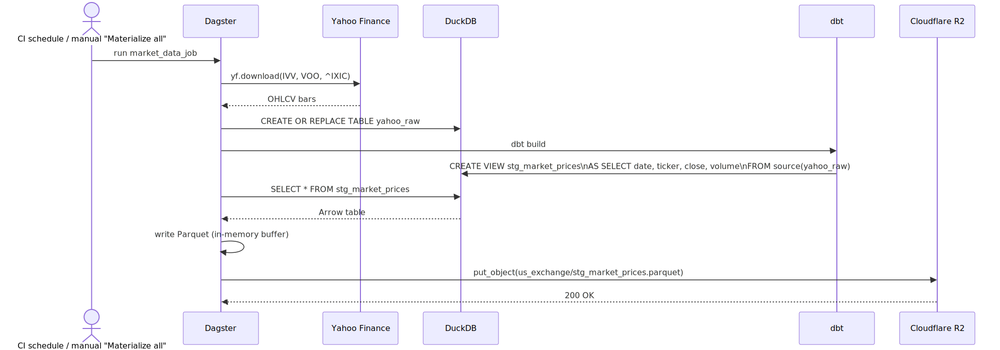

# Quant Finance ML/DL Analytics — Project Wiki

## Project Overview

A personal quant finance analytics platform. The end goal is an automated pipeline that fetches financial data, transforms it into Parquet files, stores it in Cloudflare R2, serves it via a FastAPI backend, and displays it on a Vercel-hosted frontend.

---

## System Architecture



[View Mermaid source](diagrams/system/system.mmd)

Solid nodes/edges are live today; dashed nodes (FastAPI backend, Vercel data flow) are planned but not yet built — see the [Roadmap](#roadmap).

---

## Infrastructure



[View Mermaid source](diagrams/infrastructure/infrastructure.mmd)

- **Compute:** GitHub Actions runner executes the Dagster job (`market_data_job`); DuckDB is used only as an in-run compute engine and does not persist across runs.
- **Storage:** Cloudflare R2 is the durable system of record — the pipeline writes Parquet there on every run.
- **Hosting:** Vercel hosts the static Frontend (project `quant-fintech-frontend`). A backend host is planned once FastAPI exists.
- **Local dev:** `.venv` + `dagster dev` for manual runs against the same DuckDB/dbt project.

---

## Database



[View Mermaid source](diagrams/database/database.mmd)

Two tables exist inside the DuckDB file used during a pipeline run:
- `yahoo_raw` — raw OHLCV bars landed by `raw_market_prices` (`date, ticker, open, high, low, close, adj_close, volume`).
- `stg_market_prices` — a dbt **view** (not a materialized table) over `yahoo_raw`, declared as a dbt source and selecting down to `date, ticker, close, volume`. This is what gets written to Parquet and pushed to R2.

---

## Class Architecture (planned)

Not yet authored. The Frontend currently has a real OOP model (`Investment` base class → `IndexFund` / `Super` / `SavingsAccount`, plus `CalculatorApp` and `GrowthChart`) driving the placeholder calculator, but this is still evolving — the class diagram will be added under `diagrams/classes/` once that logic settles as part of building out the investment-logic classes properly.

---

## API Architecture (planned)

Not yet authored. `Backend/` is currently empty — no FastAPI app exists, and the Frontend makes no API calls yet. The diagram will be added under `diagrams/api/` once the FastAPI backend (reading Parquet from R2 via DuckDB) is built out.

---

## Major Workflows



[View Mermaid source](diagrams/workflows/workflows.mmd)

**Current DAG** (see [Sprint 1 Outcomes](sprint-1-data-engineering-outcomes.md) for full detail, lineage diagram, and the reasoning behind every change):

```
raw_market_prices  →  stg_market_prices  →  market_prices_parquet
  (yfinance fetch)     (dbt model)            (Parquet → R2)
```

- `data_pipeline/assets/us_exchange/extract.py` — `raw_market_prices`: fetches OHLCV bars from yfinance, lands them in DuckDB as table `yahoo_raw`.
- `data_pipeline/assets/dbt_assets.py` — `dbt_market_assets`: runs the dbt project via `dagster-dbt`, producing `stg_market_prices`.
- `data_pipeline/assets/us_exchange/load.py` — `market_prices_parquet`: reads the dbt output, writes Parquet, uploads to R2.
- `data_pipeline/definitions.py` — wires all three into one `Definitions` object plus `market_data_job`, the job intended to be run on a schedule (see [Deployment](#deployment)).

**Adding a new asset:**
1. Define it with `@dg.asset` in the relevant file under `data_pipeline/assets/`
2. Import it in `data_pipeline/definitions.py` and add it to the `assets=[...]` list in `dg.Definitions`

---

## External Integrations

| Integration | Purpose | Status |
|---|---|---|
| Yahoo Finance (`yfinance`) | Source of daily OHLCV bars for `IVV`, `VOO`, `^IXIC` | Live |
| Cloudflare R2 | Durable Parquet storage, read by the (future) backend | Live |
| Vercel | Hosts the static Frontend | Live (placeholder content) |

---

## Development Setup

### Prerequisites
- Python 3.x
- Node.js / npm (for Vercel CLI, and for rendering Mermaid diagrams locally)

### Python Environment

```powershell
# Activate the venv (Windows)
.venv\Scripts\activate

# Install the project (installs dagster, dagster-dbt, duckdb, dbt-core, dbt-duckdb, etc.)
pip install -e .
```

### Run Dagster Locally

```powershell
dagster dev
# or explicitly point to the definitions file:
dagster dev -f data_pipeline/definitions.py
```

Then open `http://localhost:3000` in a browser to use the Dagster UI, and click "Materialize all" to run the full DAG.

### Run the DAG headlessly

```powershell
dagster job execute -m data_pipeline -j market_data_job
```

### Render architecture diagrams locally

```bash
bash scripts/generate-diagrams.sh
```

Renders every `.mmd` file under `docs/diagrams/` to an `.svg` beside it. Requires Node.js (pulls `@mermaid-js/mermaid-cli` via `npx` on first run).

---

## Deployment

### Frontend → Vercel

```powershell
cd Frontend
vercel
```

### Data pipeline → GitHub Actions

`.github/workflows/daily-pipeline.yml` runs `dagster job execute -m data_pipeline -j market_data_job` daily at 06:00 UTC (plus `workflow_dispatch` for manual runs), reading `R2_*`/`CLOUDFLARE_ACCOUNT_ID` from repo secrets. This replaces the earlier `pipeline.yml` that was deleted in a previous commit — the file was previously invisible to git because `.github/workflows` was gitignored; that rule has now been removed so this workflow is tracked. It still needs the repo secrets configured under Settings → Secrets and variables → Actions before it can run successfully (see [Sprint 1 Outcomes](sprint-1-data-engineering-outcomes.md#follow-ups--known-gaps)). Until then, run the pipeline manually via `dagster dev` or `dagster job execute` (see [Development Setup](#development-setup)).

### Diagrams → GitHub Actions

`.github/workflows/diagrams.yml` runs on every push to `main` that touches `docs/diagrams/**/*.mmd`, renders all Mermaid sources to SVG via `scripts/generate-diagrams.sh`, and commits the resulting `.svg` files back with `[skip ci]` (so the commit can't retrigger itself).

---

## Environment Variables

Stored in `.env` at the project root (gitignored). Required by the Dagster pipeline to write to Cloudflare R2.

| Variable | Purpose |
|---|---|
| `R2_ACCESS_KEY_ID` | Cloudflare R2 access key |
| `R2_SECRET_ACCESS_KEY` | Cloudflare R2 secret key |
| `R2_ENDPOINT` | R2 S3-compatible endpoint URL |
| `R2_BUCKET` | Target bucket name |
| `CLOUDFLARE_ACCOUNT_ID` | Cloudflare account ID |

Loaded automatically by `data_pipeline/definitions.py` via `python-dotenv`'s `load_dotenv()` when running locally. In CI, the same variable names would be injected directly as env vars from repo secrets — no `.env` file needed there.

---

## Repository Structure

```
.
├── data_pipeline/                    # Dagster pipeline
│   ├── definitions.py                # Definitions: assets + resources + market_data_job
│   ├── project.py                    # Shared paths, DbtProject, manifest prep
│   ├── assets/
│   │   ├── dbt_assets.py             # @dbt_assets (dbt build -> stg_market_prices)
│   │   └── us_exchange/
│   │       ├── extract.py            # @asset raw_market_prices (yfinance -> DuckDB)
│   │       └── load.py               # @asset market_prices_parquet (DuckDB -> R2)
│   ├── resources/
│   │   └── r2.py                     # R2Resource (boto3 wrapper for Cloudflare R2)
│   └── dbt_project/                  # dbt project (duckdb adapter)
│       └── models/us-exchange/staging/
│           ├── _sources.yml          # declares source market.yahoo_raw
│           └── stg_market_prices.sql
├── Backend/                          # Empty — FastAPI + DuckDB planned
├── Frontend/                         # Static site deployed to Vercel
│   ├── index.html                    # Placeholder calculator UI
│   ├── JS/                           # Investment.js, Chart.js, app.js
│   └── .vercel/                      # Vercel project config (links to quant-fintech-frontend)
├── docs/                             # Documentation hub
│   ├── WIKI.md                       # This file
│   ├── sprint-1-data-engineering-outcomes.md
│   ├── diagrams/                     # Mermaid .mmd sources + rendered .svg
│   │   ├── system/  infrastructure/  database/  workflows/
│   │   └── classes/  api/            # scaffolded, awaiting future architecture
│   └── images/                       # Screenshots and supporting images
├── scripts/
│   └── generate-diagrams.sh          # Renders all docs/diagrams/**/*.mmd -> .svg
├── .github/workflows/
│   ├── daily-pipeline.yml            # Scheduled (06:00 UTC) + manual market_data_job runs
│   └── diagrams.yml                  # Auto-renders + commits diagram SVGs on push to main
├── pyproject.toml                    # Registers data_pipeline as the Dagster module
├── .venv/                            # Local Python venv (gitignored)
├── .env                              # Secrets — gitignored (see Environment Variables above)
└── CLAUDE.md                         # Guidance for Claude Code working in this repo
```

---

## Tech Stack

| Layer | Technology | Status |
|---|---|---|
| Orchestration | Dagster (+ dagster-dbt) | 3-asset DAG live: extract → dbt → load-to-R2 |
| Transform | dbt (duckdb adapter) | 1 staging model (`stg_market_prices`) |
| Storage | Cloudflare R2 | Live — pipeline writes Parquet to it each run |
| Backend API | FastAPI + DuckDB | Not started |
| Frontend | Static HTML → Vercel | Deployed (placeholder) |
| CI/CD trigger | GitHub Actions | Diagram-render workflow live; daily pipeline schedule committed, awaiting repo secrets |
| Data format | Apache Parquet | Live — written and verified in R2 |
| Docs | Mermaid diagrams + WIKI | This system |

---

## Roadmap

### Setup (Original)
- [x] GitHub repo
- [ ] Connect Claude (in progress)
- [ ] Connect Obsidian
- [x] Connect Dagster
- [x] Connect Cloudflare R2
- [x] GitHub Actions schedule for the data pipeline (`.github/workflows/daily-pipeline.yml`, committed; needs repo secrets before it can run — see [Sprint 1 Outcomes](sprint-1-data-engineering-outcomes.md#follow-ups--known-gaps))
- [x] Connect Vercel
- [ ] Build full DevOps pipeline

### Sprint 1 — Data Engineering ✅
- [ ] Create domain developer account (data source)
- [x] Write data retrieval Python script, test output to Parquet
- [x] Upload Parquet files to Cloudflare R2

Full writeup: [Sprint 1 — Data Engineering Outcomes](sprint-1-data-engineering-outcomes.md)

### Sprint 2 — Backend (planned)
- [ ] FastAPI app in `Backend/`
- [ ] DuckDB reads Parquet from R2
- [ ] JSON API endpoints
- [ ] Author `diagrams/api/api.mmd` once endpoints exist

### Sprint 3 — Frontend (planned)
- [ ] Replace placeholder with real charts/tables
- [ ] Fetch data from FastAPI
- [ ] Author `diagrams/classes/class-diagram.mmd` once the investment-logic classes settle

---

## Sprint Outcomes

Detailed, per-sprint knowledge-base pages live in `docs/` and are linked from here as each sprint wraps up:

- [Sprint 1 — Data Engineering Outcomes](sprint-1-data-engineering-outcomes.md) — DAG lineage, full file tree, the reasoning behind every logic/structure change, bugs found during verification, and how everything was tested end-to-end.

---

## Important Technical Decisions

- `Frontend/index.html` is currently UTF-16 LE encoded (PowerShell `Out-File` artifact). When rewriting it, use UTF-8 — the Write tool does this automatically. If using PowerShell, pass `-Encoding utf8`.
- The `.venv/` directory is gitignored. Always activate it before running Python commands.
- Dagster uses `pyproject.toml` to discover the `data_pipeline` module — don't rename the directory without updating that config.
- `market.duckdb`, dbt's `target/`/`logs/`, and `*.parquet` are all gitignored — they're regenerated every run and should never be committed. R2 is the durable store, not the local DuckDB file.
- Mermaid `.mmd` files under `docs/diagrams/` are the editable source of truth for architecture diagrams; `.svg` files beside them are generated by `scripts/generate-diagrams.sh` / CI and should never be hand-edited.
